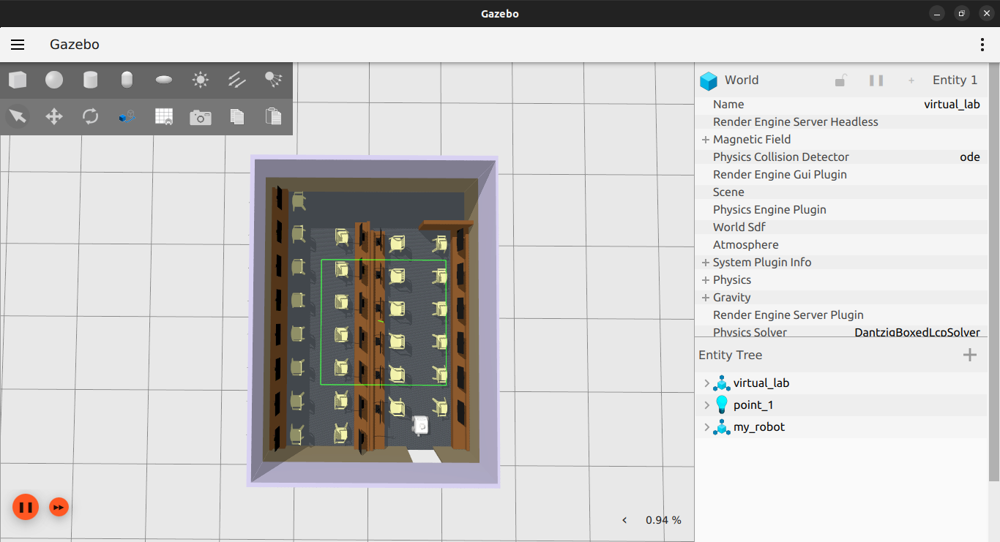
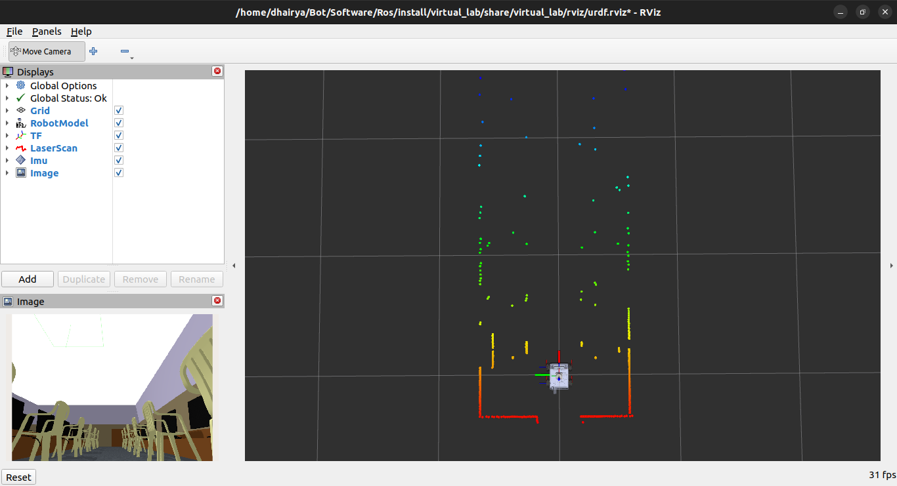

# Autonomous Ground Vehicle (AGV)

> A ROS 2-based autonomous four-wheel differential drive mobile robot for localization, mapping, autonomous navigation, exploration, and semantic perception.


---

## 📖 Overview

This project focuses on the development of an **Autonomous Ground Vehicle (AGV)** capable of operating in both indoor and outdoor environments. The robot utilizes **Simultaneous Localization and Mapping (SLAM)**, autonomous exploration, path planning, and deep learning-based semantic perception to navigate unknown environments while building semantically rich maps.

The platform is built entirely on **ROS 2**, making it modular, scalable, and suitable for research and real-world robotics applications.

---

## ✨ Features

- 🚗 Four-wheel differential drive robot
- 📍 Real-time localization using 2D LiDAR
- 🗺️ Simultaneous Localization and Mapping (SLAM)
- 🌍 Autonomous exploration of unknown environments
- 🎯 Autonomous navigation with obstacle avoidance
- 📦 Semantic segmentation using deep learning
- 📌 Object pose estimation relative to robot frame
- 🧠 Semantic mapping
- 📷 Intel RealSense D435i integration
- 🐳 Dockerized deployment
- 🔧 Modular ROS 2 architecture
- 📚 Git-based collaborative development

---

# Hardware

| Component | Model |
|-----------|------|
| SBC | NVIDIA Jetson Orin Nano |
| Camera | Intel RealSense D435i |
| LiDAR | 2D LiDAR |
| IMU | MPU / Compatible IMU |
| Motors | Servo Motors |
| Motor Driver | Servo Driver |
| Microcontroller | STM32 / Arduino |
| Battery | LiPo |

---

# Software Stack

- ROS 2 Jazzy
- Gazebo (Ignition)
- RViz2
- Docker
- OpenCV
- PCL
- SLAM Toolbox
- Nav2
- TF2
- RealSense ROS
- Git & GitHub

---

# Repository Structure

```text
.
├── config/
├── description/
├── launch/
├── maps/
├── meshes/
├── rviz/
├── urdf/
├── worlds/
├── src/
├── docker/
└── README.md
```

---

# Current Progress

## ✅ Robot Model Imported into Gazebo

The robot URDF has been successfully imported into a custom Gazebo world.

<p align="center">



</p>

---

## ✅ RViz Visualization

Robot model, TF tree and LiDAR scans are successfully visualized in RViz2.

<p align="center">



</p>

---

# Development Roadmap

## Phase 1 — Robot Description

- [x] Robot URDF
- [x] Gazebo Simulation
- [x] RViz Visualization
- [x] LiDAR Integration
- [ ] IMU Integration
- [ ] Differential Drive Controller

---

## Phase 2 — Localization & Mapping

- [ ] TF Tree
- [ ] Robot Localization
- [ ] SLAM Toolbox
- [ ] Save Maps

---

## Phase 3 — Navigation

- [ ] Nav2 Stack
- [ ] Global Planner
- [ ] Local Planner
- [ ] Obstacle Avoidance

---

## Phase 4 — Autonomous Exploration

- [ ] Frontier Detection
- [ ] Exploration Planner
- [ ] Automatic Map Completion

---

## Phase 5 — Semantic Perception

- [ ] RealSense Integration
- [ ] Semantic Segmentation
- [ ] Object Detection
- [ ] Pose Estimation
- [ ] Semantic Mapping

---

## Phase 6 — Deployment

- [ ] Docker Support
- [ ] Jetson Deployment
- [ ] Hardware Testing
- [ ] Outdoor Testing

---

# Future Work

- Multi-floor mapping
- Dynamic obstacle prediction
- Visual-Inertial SLAM
- Multi-robot collaboration
- Human-robot interaction
- Cloud robotics
- Digital twin integration

---

# Gallery

| Gazebo | RViz |
|---------|------|
|  |  |

---

# Authors

- **Amrit Singh**
- **Yash Dilkhush**
- **Devanshu Mangal**
- **Dhairya Prajapati**
- **Vansh Sadadiwala**

---

# License

This project is licensed under the MIT License.
